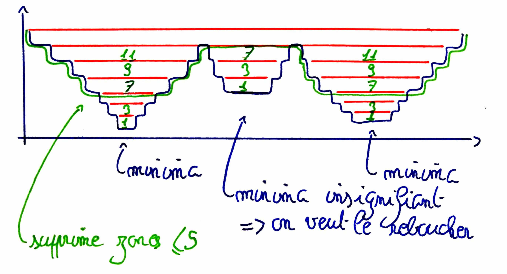

# Réunion du 16 mai 2019

## Participants 

Encadrants du projet :
* J. COUSTY : `jean.cousty@esiee.fr`
* Y. KENMOCHI : `yukiko.kenmochi@esiee.fr`

Participants du projet :
* Clément CHOMICKI : `clement.chomicki@edu.esiee.fr`
* Amaury BARUZY : `amaury.baruzy@edu.esiee.fr`
* Alexandre LEBLON : `alexandre.leblon@edu.esiee.fr`
* Maylis MONTANI : `maylis.montani@edu.esiee.fr`

## Compte-rendu de la réunion

### Ce que nous avons fait
* Clément et Barbara ont appliqués le watershade et corrigé certains défauts de séparation des grains de sable. Ils ont aussi cherché de nouveaux outils pour régler les problèmes générés par le watershade pour obtenir une qualité optimale. 
* Amaury s'est chargé de la visualisation graphique de points dans un espace 3D. 
* Maylis a créé une interface graphique permettant d'afficher plusieurs onglets et de générer une aide spécifique à chaque onglet. 
* Alexandre a fait la liste des outils restant à implémenter pour les rendre accessibles depuis l'interface et a aidé Maylis à trouver les bons outils pour l'interface graphique. 

### Partie traitement d'image

Clément nous a expliqué qu'il avait fini d'utiliser l'outil du watershade, mais qu'un problème subsistait : certains grains de sables ne sont pas parfaitement sphérique ce qui engendre sur certaines coupes 2D une séparation innexistante. Sa solution consiste à récupérer les barycentres des cercles et de comparer l'aire sur différentes images pour voir si celle-ci est cohérente. Cela permettrait de réassembler les grains qui n'auraient pas dû être séparés.

M. Cousty nous a dit qu'il ne fallait pas s'intéresser aux grains tronqués aux extrémités des images car une image complète ne comporterait aucun grain de sable tronqué.

Nous avons montré aux professeurs encadrants des images de séparation et de repérage des barycentres. Les données n'étant pas parfaitement sphériques, nous obtenons deux minimas sur la carte des distances. M. Cousty nous a expliqué un autre moyen que celui de Clément qui consiste à reboucher les minimas qui ne correspondent pas à ce qu'on attend en supprimant les minimas les moins significatifs en fonction de leur pertinence selon leur taille (en pixels), profondeur, ou volume. Différents outils sur 'Pink' permettent de faire du filtrage morphologique comme la fermeture par aire de paramètre 'x' ou en anglais 'area opening' ; la fermeture par volume avec l'outil 'vol minima' ou 'vol maxima'. De manière générale, les outils de la librairie 'Pink' sont linéaires et sont donc très efficaces.

D'autre part, M. Cousty nous a demandé d'aller voir l'outil 'pgmtolist' du module 'geometry complenator' pour établir une liste de centres des grains de sables et ne plus avoir besoin de repasser plusieurs fois sur la même image, car notre programme met du temps à s'exécuter.

Pour établir les distances, nous avons utilisé '4-dist' (?) mais M. Cousty nous recommande d'utiliser '3-dist' car même si les distances ne sont pas entières, leur distances euclidiennes quadratiques le sont. Pour le problème de format qu'engendre l'utilisation de l'outil '3-dist', il nous est recommandé d'aller chercher un outil dans la librairie 'Pink' qui nous permettrait de passer d'une image de carte de distance à une image dans laquelle les pixels sont codés en 'long to byte'. M. Cousty nous dit que la paramètre qu'il a utilisé était '0'.

Pour le moment, Clément a utilisé l'outil 'select' pour selectionner un grain. M. Cousty nous recommande d'utiliser des labels qui repèreront de manière unique un grain dans une image 2D ou 3D, ce qui permettrait d'améliorer l'efficacité de notre programme.

Nous n'avons pas encore commencé à travailler sur les images 3D mais uniquement sur l'analyse des images 2D. Nous devons donc pour la prochaine fois avoir réussi à représenter en 3D les grains de sable, grâce notamment à l'outil '3D view' qui pourrait nous être utile par ailleurs dans l'interface.

### Partie Interface graphique

M. Cousty nous demande de générer le maillage de nos données extraire la surface de la structure à partir d'une image 3D binaire. Le format utilisé dans 'Pink' pour ce genre d'outil est 'vtk' qui correspond à une liste de points de triangles définissant la surface d'un grain de sable. Dans la librairie 'Pink' nous pouvons utiliser 'mcube' qui permet de générer un maillage à partir d'images en niveau de gris.

### Questions

**Quels outils vous semblent nécessaires dans l'interface ?**
* Visualisation des coupes des images
* Cliquer et récupérer les caractéristiques du grain (coordonnées dans l'espace, taille...) 
* Avoir accès à des informations générales (nombre de grains, taille moyenne, mouvement global...)
* Pouvoir zoomer dans l'espace 3D
* Pouvoir sauvegarder les résultats (caractéristiques, vidéos du mouvement dans un format classique)
* Pour la représentation du mouvement, avoir l'interpolation (on force le modèle à passer à travers un certain nombre de points de contrôle)
* Ce serait bien de pouvoir visualiser la trajectoire et l'orientation/la rotation des grains (mais pour des grains sphériques, c'est compliqué) à l'aide de flèches sur les grains
